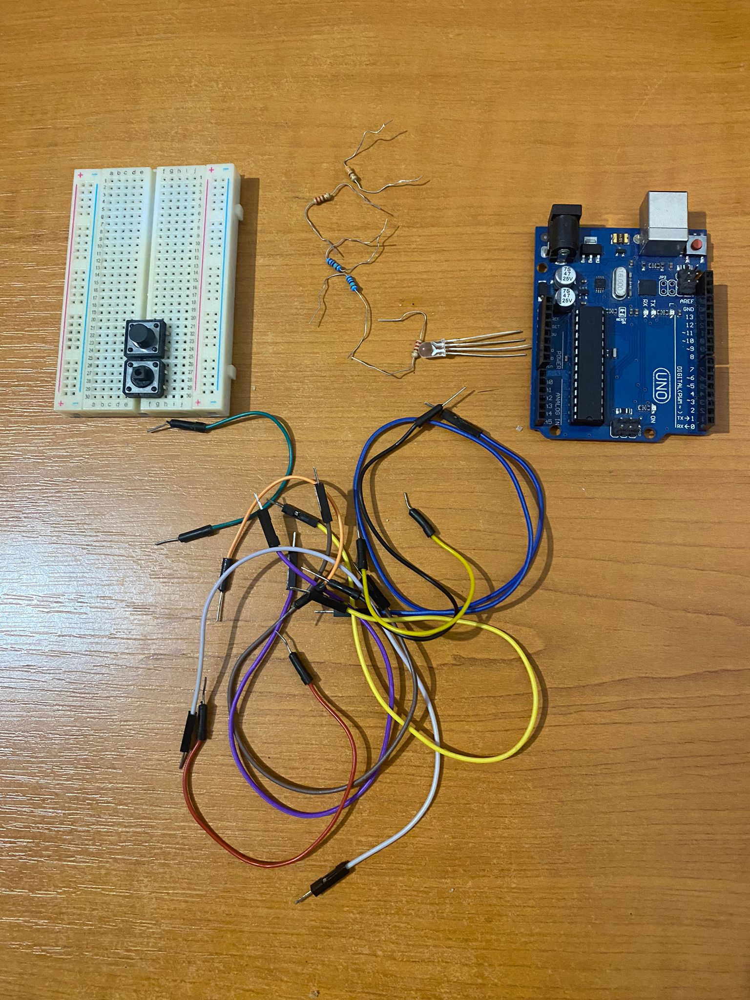
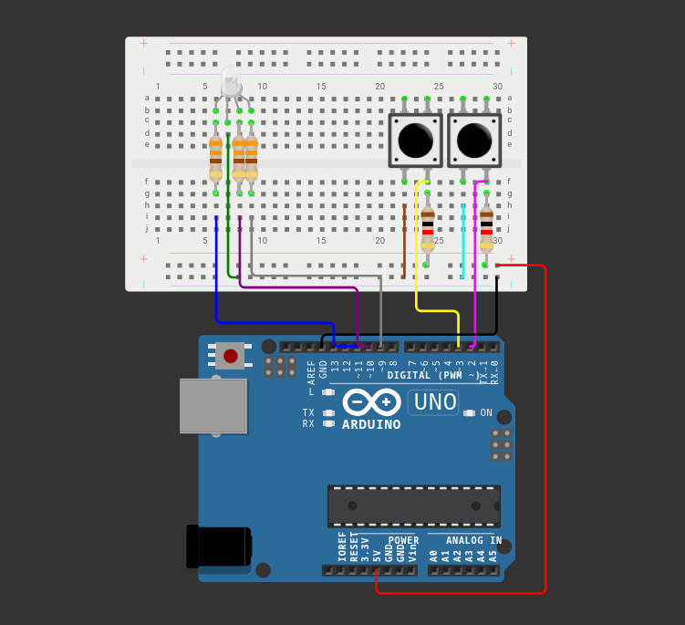
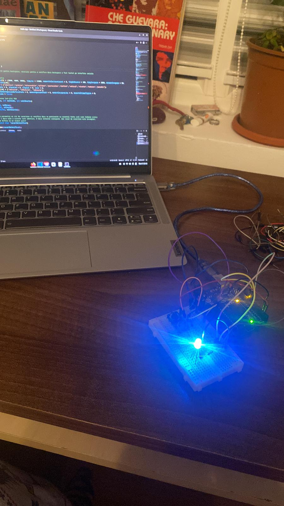
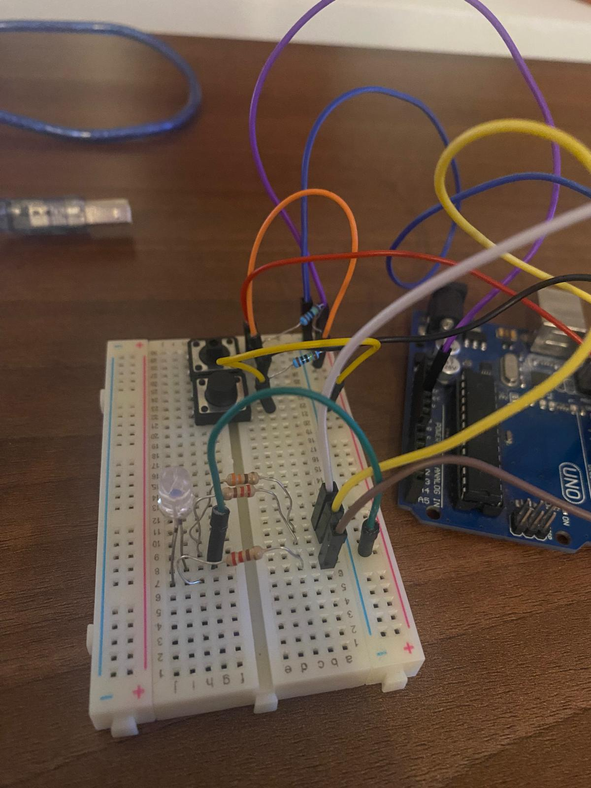
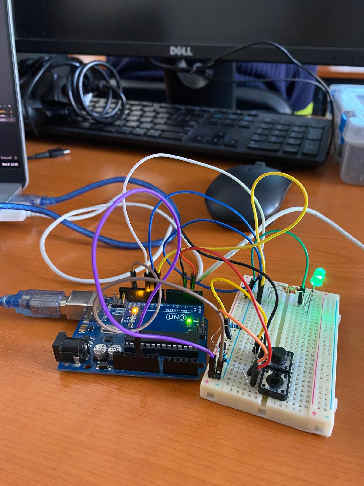
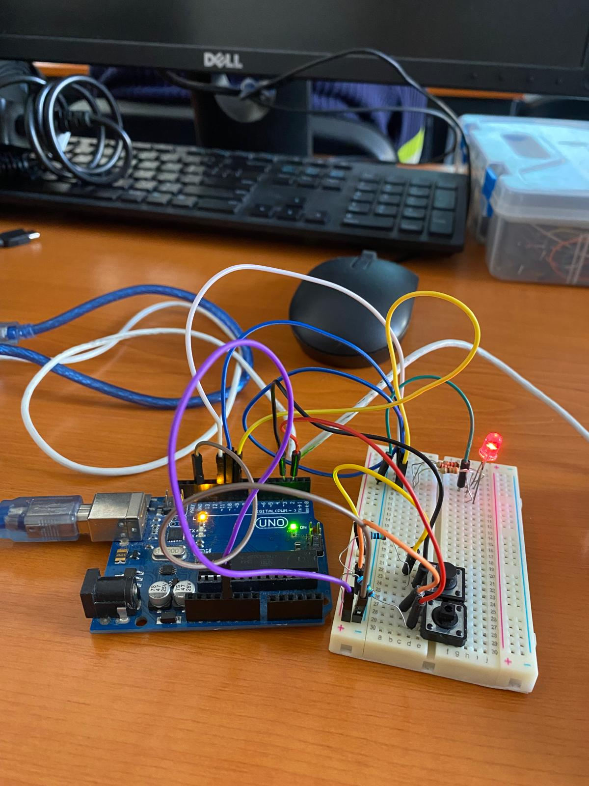

## 1. Detalii Tehnice:

În starea de repaus, LED-ul va avea culoarea albă.
La apăsarea butonului de start, LED-ul va clipi timp de 3 secunde, indicând o numărătoare inversă până la începerea rundei.
În timpul unei runde: LED-ul va fi verde dacă textul introdus este corect și va deveni roșu în caz de greșeală.

Modul de repaus: Dacă jocul este oprit, apăsarea butonului inițiază o nouă rundă după o numărătoare inversă de 3 secunde.
În timpul unei runde: Dacă runda este activă, apăsarea butonului o va opri imediat.

Butonul de dificultate controlează viteza cu care apar cuvintele și poate fi folosit doar în starea de repaus.
La fiecare apăsare, dificultatea se schimbă ciclind între: (Easy, Medium, Hard).
La schimbarea dificultății, se trimite un mesaj prin serial: “Easy/Medium/Hard mode on!”.

Se va crea un dicționar de cuvinte.
În timpul unei runde, cuvintele vor fi afișate în terminal într-o ordine aleatorie.
Dacă cuvântul curent a fost scris corect, un cuvânt nou va fi afișat imediat. Dacă nu, un nou cuvânt va apărea după intervalul de timp stabilit în funcție de dificultate.

Timpul alocat pentru o rundă este de 30 de secunde.
La sfârșitul fiecărei runde, se va afișa în terminal câte cuvinte au fost scrise corect.

  ## 2. Flow:
  Jocul este în repaus. LED-ul RGB are culoarea albă.

Se alege dificultatea jocului folosind butonul de dificultate, iar în terminal va apărea “Easy/Medium/Hard mode on!”.

Se apasă butonul de start/stop.

LED-ul clipește timp de 3 secunde, iar în terminal se va afișa numărătoarea înversă: 3, 2, 1.

LED-ul devine verde și încep să apară cuvinte de tastat.

La tastarea corectă, următorul cuvânt apare imediat. Dacă nu se tasteaza cuvântul în timpul stabilit de dificultate, va apărea un nou cuvânt.

O greșeală face LED-ul să devină roșu. Pentru a corecta cuvântul, se va folosi tasta BackSpace.

Dupa 30 de secunde, runda se termină, iar în terminal se va afișa scorul: numărul total de cuvinte scrise corect.

Jocul se poate opri oricând cu butonul de start/stop. 

## Componentele folosite:
  - Arduino UNO (ATmega328P microcontroller)
  - 1x LED RGB (pentru a semnaliza dacă cuvântul corect e scris greșit sau nu)
  - 2x Butoane (pentru start/stop rundă și pentru selectarea dificultății)
  - 5x Rezistoare (3x 220/330 ohm, 2x 1000 ohm)
  - Breadboard
  - Fire de legătură

  
  
## Schema electrica a circuitului implementat pe Wokwi
  

## Imagini cu Setup-ul Fizic

## link video:
  https://youtube.com/shorts/YNsN55Gsx0Y
